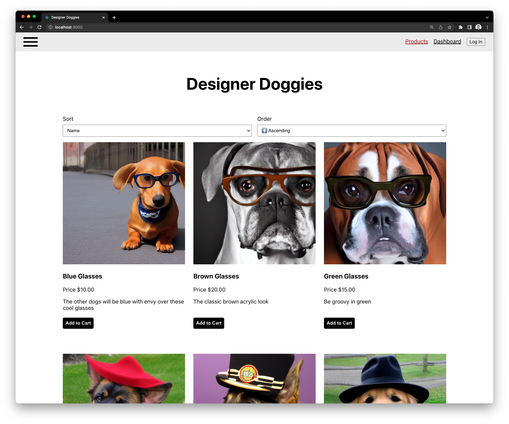

# Designer Doggies

A demonstration of a monorepo full stack web application built on the MERN (mongodb, express, react and node) stack.

---

## Getting Started

1. Install Docker Desktop
2. Run `docker-compose up --build` in the root directory
3. Open mongo compass and connect to `mongodb://localhost:27017/mongo`
4. Import the `products.json` file in the `data` directory into the `products` collection on the `mongo` database
5. Open `http://localhost:3000` in your browser
6. You should see doggies.
